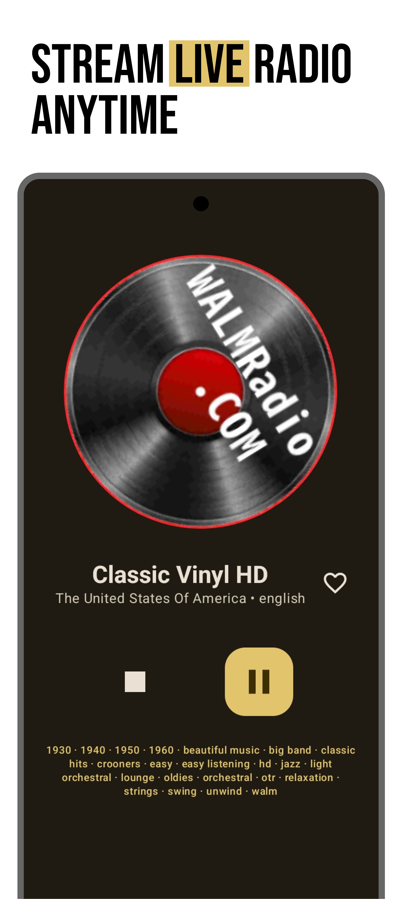
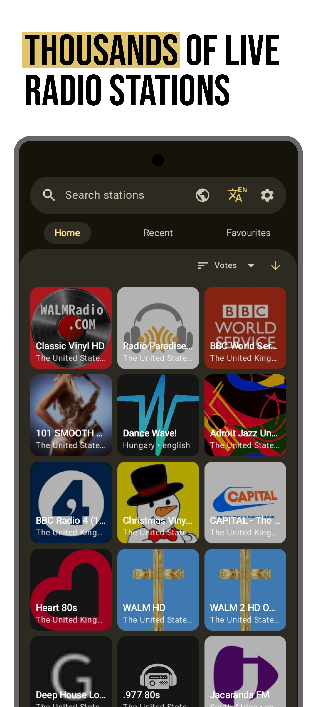
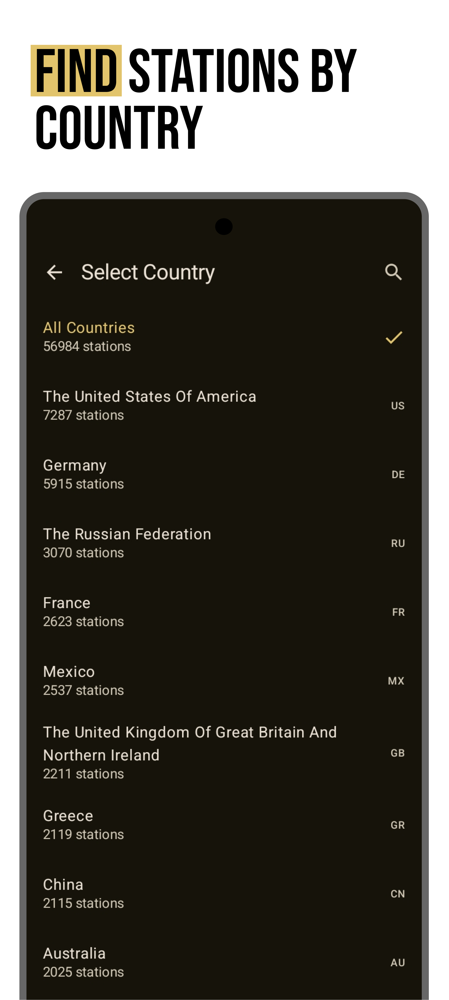
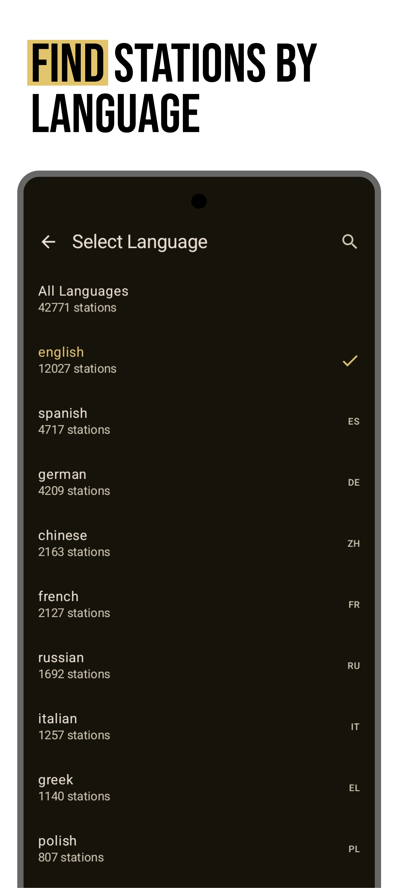

<div align="center">


# InternetRadio

InternetRadio is an Android app for discovering and listening to radio stations from around the world, with features like favorites, recent history, and advanced search by country and language.

</div>

---

## Features

- **Global Radio Access**: Browse and stream thousands of radio stations globally.
- **Search & Filter**: Easily find stations by country or language.
- **Favorites & History**: Keep track of your favorite stations and recently played streams.
- **Modern UI**: Built with Jetpack Compose for a smooth, intuitive, and responsive experience.

## Screenshots

<div align="center">
  
  
  
  
</div>

## Tech Stack

- **Language**: [Kotlin](https://kotlinlang.org/)
- **UI Framework**: [Jetpack Compose](https://developer.android.com/jetpack/compose)
- **Database**: [Room](https://developer.android.com/training/data-storage/room)
- **Dependency Injection**: [Hilt](https://developer.android.com/training/dependency-injection/hilt-android)
- **API**: [Radio Browser API](https://www.radio-browser.info/)

## Building From Source

To build InternetRadio from source, ensure you have the latest version of Android Studio installed.

1. **Clone the repository**:
   ```bash
   git clone https://github.com/armanmaurya/internetradio.git
   ```
2. **Open the project** in Android Studio.
3. **Wait for Gradle sync** to complete.
4. **Run the app** on a physical device or emulator.

## Contributing

Contributions are what make the open-source community such an amazing place to learn, inspire, and create. Any contributions you make are greatly appreciated.

Please see [CONTRIBUTING.md](CONTRIBUTING.md) for details on our code of conduct and the process for submitting pull requests.

## Open Source Libraries

InternetRadio uses the following open-source libraries:

- [Android Jetpack Libraries](https://developer.android.com/jetpack) (Compose, Room, Media3, Lifecycle, Navigation, DataStore, etc.)
- [Hilt](https://developer.android.com/training/dependency-injection/hilt-android) - A dependency injection library for Android.
- [Radio Browser API](https://www.radio-browser.info/) - A community-driven effort to collect radio stations.

## License

This project is licensed under the GNU GPL v3 License - see the [LICENSE](LICENSE) file for details.
